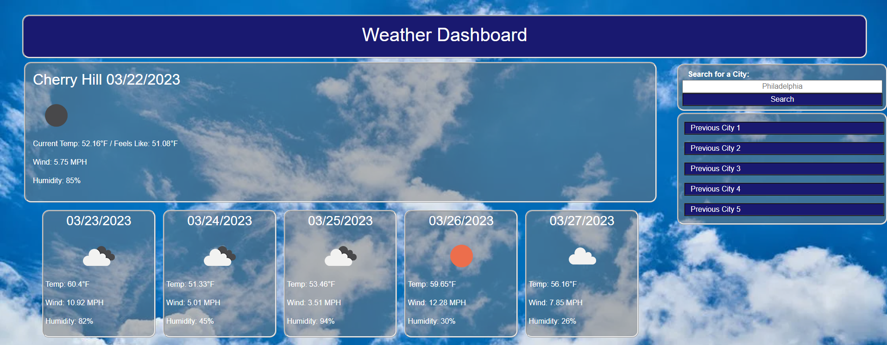

# Building A Weather Dashboard

## Description
This repository contains the self-made Weather Dashboard using HTML, CSS, and JavaScript. In addition Bootstrap and JQuery are used and data is pulled from Open Weather API, specifically through the "Current Weather", "Geocoding", and "5 Day Forecast/3 Hour Data" APIs.

## Usage
Access the finalized webpage using [this link!](https://austinl96.github.io/building_a_weather_dashboard/) Below is a preview of my work.

Once on the website, you can input a city name and it will pull up the current weather, wind speed, and humidity. It will then do the same for the next 5 days for that location. Give it a try!

## License
N/A

Royalty free background image sourced from Pexels: https://www.pexels.com/photo/cloudy-sky-531756/